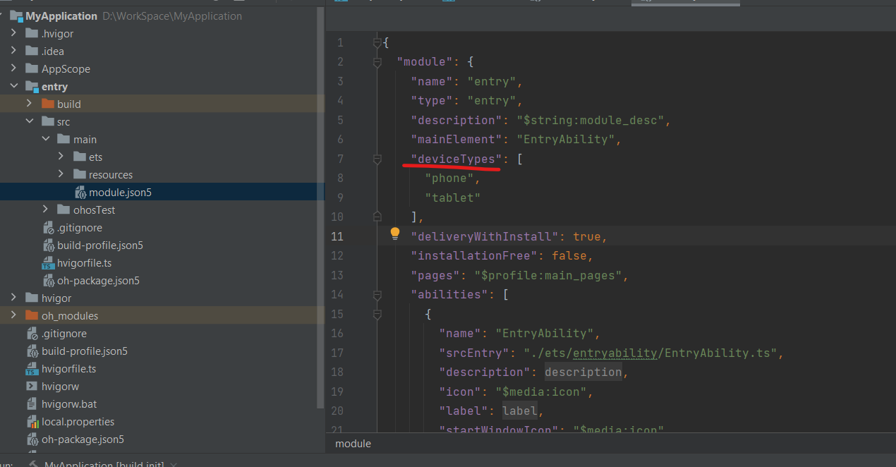
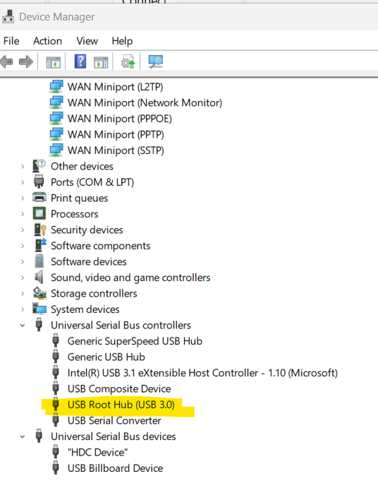
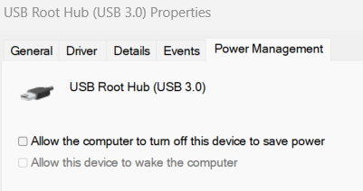
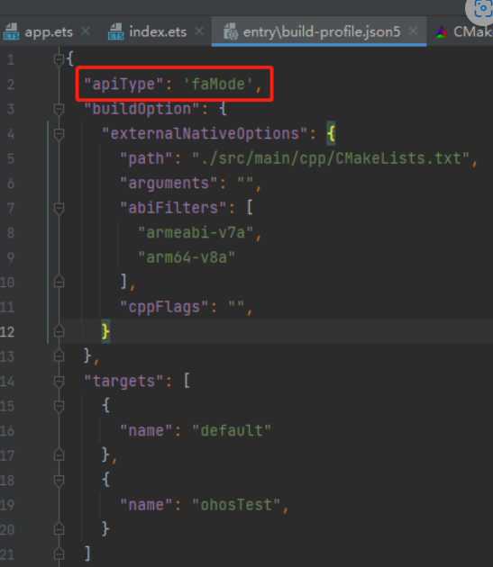
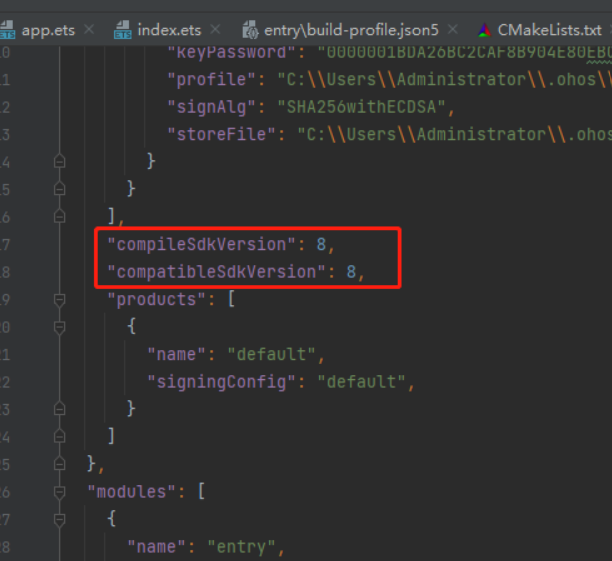
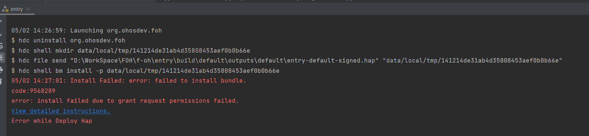

# First App

With DevEco Studio installed and its layout, project structure, and tooling covered in [Workflow](workflow.md), this page walks through creating an actual project, seeing it render, running it, and diagnosing anything that goes wrong along the way.

## Creating Your First Project

1. On the **Welcome** screen, click **New Project** (or, with a project already open, **File → New → New Project**).
2. Select a template. **Empty Ability** is the simplest starting point for a Stage-model application and is the best choice for a first project. Other templates add sample UI that is not needed at this stage.
3. Choose the device types that your application should target, such as Phone, Tablet, or Wearable. This sets the initial `deviceTypes` list in `module.json5`, which you can adjust later (see [Project Structure](workflow.md#project-structure)).
4. Fill in the project details:
    * **Project name** and **Bundle name** (reverse-domain style, e.g. `com.example.myapplication`).
    * **Save location** on disk.
    * **Compile/Compatible API** — match this to the OpenHarmony version you intend to run against (see the version/API table in [Process of Installation](installation/process.md)).
5. Click **Finish**. DevEco Studio generates the project and opens it; the first indexing pass can take a minute or two on a new machine.

!!! tip "Start from Empty Ability"
    Even if your application will need more structure, starting with **Empty Ability** and adding pages and modules yourself provides a clearer understanding of the project than removing content from a more comprehensive template.

Once the project is open, `entry/src/main/ets/pages/Index.ets` is the default page rendered first. Open it to continue.

## Using the Previewer

The **Previewer** renders ArkUI pages without an emulator or physical device, providing rapid feedback while you build the UI.

### Opening the Previewer

Open any page under `entry/src/main/ets/pages/` that contains an `@Entry @Component struct` declaration. The Previewer panel should appear automatically, usually docked to the right of the editor. If it does not:

1. Click inside the `.ets` file so it has focus.
2. Look for the **Previewer** tab along the tool window bar, or use **View → Tool Windows → Previewer**.

!!! note "First render can be slow"
    The first preview of a session compiles the module, so it can take noticeably longer than subsequent updates. Later edits generally re-render in a second or two.

### Live Updates

With the Previewer open, most changes to the page's `build()` method are reflected as soon as you save (or immediately, if **Auto-save** is enabled). This works for:

* Layout and styling changes (padding, colors, alignment).
* Adding/removing components.
* Changes to `@State` initial values.

It does **not** reliably reflect:

* Behavior driven by native code or platform APIs unavailable in the preview sandbox.
* Runtime logic that depends on a real network call, file system, or sensor.
* Some animations and gesture-driven interactions — verify those on an emulator or device.

### Multi-Device Preview

Click the device selector above the Previewer canvas to render the same page across several device profiles at once, such as phone, tablet, foldable, and wearable profiles. This helps you identify layout problems on smaller or larger screens before using an emulator.

!!! tip
    Keep at least one small-screen and one large-screen profile enabled for any page with a complex layout. Most responsive-layout problems appear immediately in this comparison view.

### Interactive Preview

By default, the Previewer is a static snapshot of the page's initial render. Switching to **Interactive Preview** mode (button above the canvas) lets you click, tap, and scroll inside the rendered page as if it were running on a device — useful for checking simple state changes (toggles, tab switches, list scrolling) without a full deploy.

### Previewer Settings

Under **Settings → Languages & Frameworks → ArkUI Previewer** (path may vary slightly by version) you can adjust:

* Which device profiles are shown by default.
* Whether the Previewer refreshes automatically or only on manual trigger.
* Rendering scale, useful on high-DPI displays where the default preview looks too large or small.

### When to Stop Trusting the Previewer

The Previewer is a productivity tool, not a substitute for testing on a real target. Always validate on an emulator or device (see [Emulator](emulator.md)) before considering a feature done, especially anything touching permissions, sensors, background tasks, or performance.

## Running Your App

After verifying the page in the Previewer, select a run target from the menu in the navigation bar and click **Run**. If no emulator or device is listed, follow [Emulator](emulator.md) to create an emulator with Device Manager or connect physical hardware.

## Debugging and Profiling

DevEco Studio's debugger and profiler help you determine why an application behaves incorrectly.

### Starting a Debug Session

Select a run target (see [Emulator](emulator.md)), then click the **Debug** icon (bug shape) instead of **Run** in the navigation bar. The app launches the same way, but now stops at breakpoints and lets you inspect state.

### Breakpoints

* Click in the gutter to the left of a line number to set a line breakpoint (a red dot appears).
* Right-click a breakpoint to configure it further:
    * **Condition** — stop only when an expression evaluates to true, for example, `index == 3`. This is useful inside loops when you need to inspect one iteration.
    * **Log message** — print a message, optionally including expression values, without pausing execution. This provides temporary logging without recompiling or modifying the source.
    * **Suspend policy** — stop only the current thread or the whole process.

### While Paused

The **Debug** tool window shows:

| Pane | Purpose |
|---|---|
| Frames | Current call stack; click a frame to inspect its local variables |
| Variables | Local variables and `this` in the selected frame, expandable for object/array contents |
| Watches | Expressions you pin so they're always visible while stepping |
| Evaluate Expression (`Alt+F8`) | Run arbitrary expressions against the current paused state, including calling functions |

Step controls:

| Action | Shortcut |
|---|---|
| Step over | `F8` |
| Step into | `F7` |
| Step out | `Shift+F8` |
| Resume program | `F9` |

!!! tip "Evaluate computed values"
    Instead of adding a temporary variable to inspect a computed value, pause at a breakpoint and use **Evaluate Expression** (`Alt+F8`). It can call methods and index into objects in the paused process, avoiding a source edit and restart.

### HiLog

The **Log** (HiLog) tool window streams the device/emulator's system log. Two filters make it usable on a busy device:

* **Tag filter** — match the tag used in your `hilog` calls (e.g. a per-module tag you define).
* **Log level** — restrict output to `WARN` and `ERROR` when diagnosing a crash, or `DEBUG` and `INFO` during normal development.

You can save a filter configuration instead of re-entering it in every session.

### Profiler

Once your app is up and running, **View → Tool Windows → Profiler** (or the toolbar icon) attaches CPU, memory, network, and energy profiling to the running app — reach for it when you actually have a performance problem to chase down, rather than as a first-app concern.

## Build Variants and Signing

To distribute an application outside DevEco Studio's Run and Debug workflow, you need a signed `.hap`. An `.app` file is a distribution archive that can contain multiple HAPs and HSPs; it is not installed directly with `hdc`.

### Debug vs. Release

By default, running or debugging from the IDE produces a **debug** build: automatically signed with a debug certificate so it can be installed on your own emulator/device, but not meant for distribution.

A **release** build is suitable for distribution or publication. It is optimized and signed with a certificate that persists across builds so that updates are trusted as coming from the same source.

Which variant gets built is controlled by the **Build Variant** selector, plus the products/targets declared in the project's `build-profile.json5` files (see [Project Structure](workflow.md#project-structure)).

### Signing Configurations

DevEco Studio supports two signing approaches:

#### Automatic Signing (recommended for getting started)

1. Go to **File → Project Structure → Signing Configs** (path may vary slightly by version).
2. Enable **Automatically generate signing configuration**.
3. Sign in with your Huawei/HarmonyOS developer account when prompted.

DevEco Studio then generates a keystore, certificate, and provisioning profile for you and wires them into `build-profile.json5` automatically. This is the fastest path and is sufficient for local testing and most individual development.

#### Manual Signing

Needed for CI pipelines, team-shared release certificates, or when a specific provisioning profile (with particular permissions/ACLs) must be used.

1. Generate a private key and CSR: **Build → Generate Key and CSR**, or via `keytool` directly if you need full control over the parameters.
2. Apply for/download a certificate and provisioning profile from the developer console using that CSR.
3. In **Project Structure → Signing Configs**, point to the `.p12`/keystore file, the certificate, and the profile, and supply the store/key passwords.
4. Reference this signing config from the relevant product entry in `build-profile.json5`.

!!! warning "Keep release keys out of the repository"
    Never commit a keystore file or its passwords. Store them in a secrets manager or CI-only environment variables, and keep only a *reference* (path/alias) in version control — see [Version Control](workflow.md#version-control) for a `.gitignore` starting point.

### Generating a Package

Once a signing configuration is in place:

* **Build → Build Hap(s)/APP(s) → Build Hap(s)** — produces a `.hap` for the current module/product.
* **Build → Build Hap(s)/APP(s) → Build APP(s)** — produces an `.app` bundle if your product is configured to build one (used for multi-HAP distribution).

Build output appears under the module's `build/` directory, and the **Build** tool window (`Alt+0`) shows progress and any failures.

### Diagnosing Signing/Permission Errors

Two errors are common enough to call out specifically (both also covered in [Common Issues and Solutions](#common-issues-and-solutions) below):

* **`compatibleSdkVersion`/`releaseType` mismatch with the device** — the minimum compatible SDK or release type does not match the target. Lower `compatibleSdkVersion` if the application does not require newer APIs, or use a matching device/emulator.
* **Install failed due to "grant request permissions failed"** — the requested permission's level (`system_basic` or `system_core`) requires the ACLs be explicitly listed in the provisioning profile used for signing. Check [this permissions reference](https://gitcode.com/openharmony/resources/blob/master/systemres/main/config.json) for the level of each permission your `module.json5` requests, and make sure your signing profile grants it.

## Common Issues and Solutions

### Cannot Find a Phone Emulator

`entry/src/main/module.json5` is the configuration file for the module. Check `deviceTypes` and add `phone` if it is missing.

### Unable to Find the BMS Service When Running on an Emulator

Wait for the emulator to finish starting. If the problem persists, clear the virtual device's data or create a new virtual device.

### Unstable USB Connection or Development Board Not Detected by the IDE

Change the USB power-management settings as follows:

1. Search for and open *Device Manager*.
2. Click to expand *Universal Serial Bus Controllers*.
3. Right-click *USB Root Hub* and select *Properties*.
4. Uncheck *Power Management* and click *OK*.

    <figure >
        
    </figure>

### Application `compatibleSdkVersion` and `releaseType` Do Not Match the Device's `apiVersion` and `releaseType`

**Cause:** The application's minimum compatible SDK version is higher than the device API version, or the release types differ.

**Solution:**

1. Open the project-level `build-profile.json5` file.
2. Set `compatibleSdkVersion` to an API level supported by the device, provided that the application does not require newer APIs. Ensure that `runtimeOS` and the SDK release type match the device.
3. Synchronize the project and run the application again.
   

### Install Failed

When you click **Run** with a device connected and detected by the IDE, the IDE may display the following message:

"Install Failed: failed to install bundle. code: 9568289, error: install failed due to grant request permissions failed."

This message indicates a permissions problem. Identify the permission that caused it.

[This documentation](https://gitcode.com/openharmony/resources/blob/master/systemres/main/config.json) lists all permissions and their levels in OpenHarmony.

OpenHarmony request permissions have three levels, from lowest to highest: `normal`, `system_basic`, and `system_core`.

If `availableLevel` is set to `system_basic`, configure the `acls` field in `UnsignedReleasedProfileTemplate.json` and add the required high-level permissions.

Use a signing profile that grants the required ACLs and reference its `.p7b` file from the signing configuration in `build-profile.json5`. The automatically generated normal-application profile cannot grant `system_basic` or `system_core` permissions.

After creating, previewing, running, debugging, and packaging the application, continue to [Emulator](emulator.md) if you have not configured one, or return to [Workflow](workflow.md) for a closer look at the IDE.
