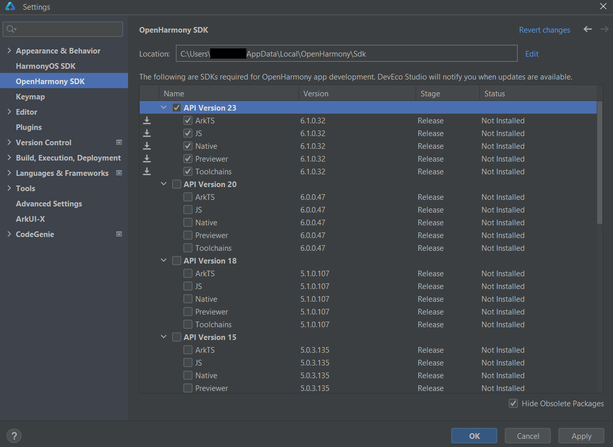

# Installation

**DevEco Studio** is an integrated development environment (IDE) based on IntelliJ IDEA, tailored for building OpenHarmony applications. It provides integrated tools for coding, debugging, and managing dependencies, making it easier to develop, test, and deploy apps for the OpenHarmony and Oniro platforms.

## System Requirements

DevEco Studio is available for Windows and macOS. Your system should meet the following requirements:

=== "Windows"
    | Item             | Requirement            |
    |------------------|-------------------------|
    | Operating System | Windows 10/11 64-bit    |
    | Memory           | At least 16 GB          |
    | Hard Disk        | At least 100 GB         |
    | Resolution       | At least 1280 × 800 px  |

=== "macOS"
    | Item             | Requirement                                       |
    |------------------|----------------------------------------------------|
    | Operating System | macOS (x86) 11/12/13/14, or macOS (Arm) 12/13/14   |
    | Memory           | At least 8 GB                                      |
    | Hard Disk        | At least 100 GB                                    |
    | Resolution       | At least 1280 × 800 px                             |

    !!! warning "Warning"
        DevEco Studio's emulator only runs on Apple Silicon (ARM) Macs. On an Intel-based Mac, use a [physical device](real-device.md) instead.

## Developer Account

!!! note "Note"
    For application development, developer verification is not required.

Before downloading DevEco Studio, you need a Huawei account. For details on registration and identity verification, see:
[HUAWEI ID Registration and Verification | HUAWEI Developers](https://developer.huawei.com/consumer/en/doc/start/registration-and-verification-0000001053628148)

In simple terms, anyone can register for an individual developer account, whether they choose to verify their identity or not. However, certain permissions reportedly require identity verification using an ID document.

According to information from the Huawei developer forum, verified developers gain access to more development resources, training materials, and market promotion. Moreover, only verified developers are allowed to publish applications.

Enterprise developers receive a broader range of services compared to individual developers. Here's a breakdown:

* Individual Developers: App Market, Themes, Product Management, Account, PUSH, New Game Pre-order, Interactive Comments, Social, HUAWEI HiAI, Watch App Market, etc.

* Enterprise Developers: App Market, Themes, Initial Release, Payment, Game Packages, App Market Promotion, Product Management, Games, Account, PUSH, New Game Pre-order, Interactive Comments, Social, HUAWEI HiAI, Watch App Market, Sports & Health, Cloud Testing, Smart Home, etc.

## Download

The latest version of DevEco Studio can be downloaded from the [official download page](https://developer.huawei.com/consumer/en/download/).

!!! note "Note"
    You need a Huawei account to download DevEco Studio.

=== "Windows"
    Download the Windows installer (`.exe`, listed as "DevEco Studio for Windows").

=== "macOS"
    Download the build matching your Mac's chip: **Mac (X86)** for Intel Macs, or **Mac (ARM)** for Apple Silicon (M-series).

## Step-by-Step Installation

=== "Windows"
    After the download completes, run the installer.

    Click **Next** until you reach the **Choose Install Location** step. If necessary, click **Browse...** to select the installation path. The installer shows the required and available space for the selected drive.

    > **Note:** If this is not your first installation, delete all files from the previous installation directory before proceeding.

    Click **Next**.

    

    In the **Installation Options** step, keep **Create Desktop Shortcut** selected. Select **Add "bin" folder to the PATH** if you want to invoke DevEco Studio's bundled command-line tools from any terminal; this option requires a restart to take effect. Adding **Open Folder as Project** to the Explorer context menu is optional.

    

    In the **Choose Start Menu Folder** step, keep the default settings and click **Install**.

    

=== "macOS"
    Open the downloaded `.dmg` file, then drag **DevEco-Studio** into the **Applications** folder shown in the same window.

    

    Wait for the copy to finish, then eject the mounted disk image.

    On first launch, macOS Gatekeeper may block the app since it was downloaded from outside the App Store — if so, go to **System Settings → Privacy & Security** and click **Open Anyway**.

### Initial Setup

When you run DevEco Studio for the first time, follow the setup wizard that appears. You need to accept the terms and conditions to move forward.

!!! note "Note"
    DevEco Studio bundles OpenJDK, so a separate JDK installation is not required for basic use.

!!! note "Behind a proxy"
    If your network requires a proxy, configure it now under **Settings → Appearance & Behavior → System Settings → HTTP Proxy** — otherwise the steps below may fail to download SDK components.

    === "Windows"
        Reach Settings via **File → Settings**.

    === "macOS"
        Reach Settings via **DevEco Studio → Settings** in the menu bar (or the `⌘,` shortcut).

The environment configuration is now complete.

## Install Relevant APIs

To run applications for OpenHarmony, you also need to install the relevant APIs.

Open **DevEco Studio** and go to `Settings` → `OpenHarmony SDK`. Check the API version(s) you need and click **Apply** to download.

You don't strictly have to do this ahead of time — if a project needs an API version you haven't installed yet, DevEco Studio will prompt you to download it automatically the first time you build or run the app.

With **DevEco Studio 6.1**, select **API Version 23** for development.

Refer to the [version mapping table](../index.md#openharmony-version-and-api-level-reference) to choose the appropriate API level for your target OpenHarmony system.

After setting up a developer account, installing DevEco Studio, and configuring the environment, continue to [IDE Basics](workflow.md) to explore the IDE.